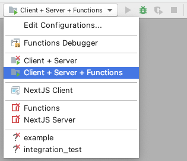

# Anonymous Video Calls (Club2D)

Anonymous video calls (aka. Club2D) allow you to communicate with someone using your facial expression and animation, without revealing your identity, physical background or other sensitive information. It allows you to safely share expressions and emotion.

This application uses Ably. It sends 3D faces coordinates between users via Ably pub/sub messages a few times per second (the configured frame rate), and updates additional metadata (color of face mesh, username) when users change it. Metadata is updated only when changed, using Ably presence messages.

This application uses MediaPipe, Three.js, Next.JS and React together. Mediapipe is used to process your camera feed to generate a face mesh and human body keypoints. Three.JS is used to render the face points, username text (and in the future, more objects), Next.JS is used to build a fast React app quickly and conveniently.

There are 2 subprojects:

- `web`: The web client which can be built and hosted online. Users visit this page to join calls between each other.
- `functions`: A directory containing serverless functions, which can perform token authentication, the recommended way of authentication. This keeps the Ably API key on the server, where a malicious user can't steal or abuse the API key.

## Tech used

- Cloud providers
  - [Ably](https://ably.com) is used to transfer data between users
  - [Cloudflare Pages](https://pages.cloudflare.com/) is used to host the client application
  - [Firebase cloud functions](https://firebase.google.com/docs/functions) are used to host a serverless function to generate tokens without revealing/ shipping the API key in browsers
- Web client
  - [Ably Javascript/ Typescript SDK](https://www.npmjs.com/package/ably): Sending 3D faces between users
  - [MediaPipe](https://mediapipe.dev): Getting 3D face mesh coordinates
  - [Three.js](https://threejs.org/): Rendering the 3D faces and text
  - [NextJS](http://nextjs.org/): Building a fast react app efficiently
  - [React](https://reactjs.org/): UI Rendering and state management

## Debugging

- Debug configurations exist for Webstorm (Jetbrains IDE). These debug configurations allow you to debug all components of the app (firebase functions, client app, client app build system) from 1 button:
  
